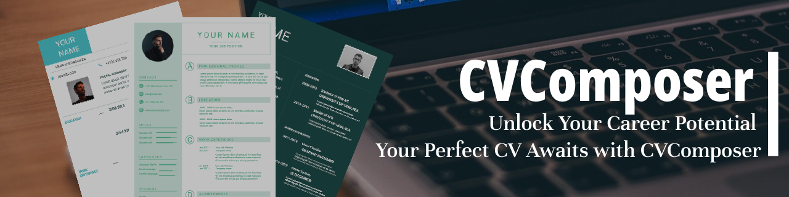

# CVComposer



## Overview

CVComposer is a web-based platform designed to help job seekers create impressive CVs (Curriculum Vitae) and Cover Letters with ease. This README provides an overview of the MVP (Minimum Viable Product) version of CVComposer, highlighting its features, installation instructions, and usage guidelines.

## Features

The CVComposer MVP includes the following key features:

1. **CV Creation:** Users can create and edit CVs using customizable templates.


2. **Content Customization:** Users can personalize their CVs and Cover Letters by adding and editing content, including personal information, work experience, education, and more.

3. **Design Customization:** Users can customize the design of their CVs and Cover Letters by adjusting colors and fonts to match their preferences.

4. **Preview and Export:** Users can preview their documents in real-time and export them as downloadable PDF files.

5. **Responsive Design:** The platform is responsive and accessible on various devices, including desktops, tablets, and smartphones.

## Installation

To run the CVComposer MVP locally for development or testing purposes, follow these steps:

1. Clone the repository to your local machine:

   ```bash
   git clone https://github.com/MelakuDemeke/CVComposer.git
   ```

2. Navigate to the project directory:

   ```bash
   cd CVComposer
   ```

3. Install the required dependencies:

   ```bash
   npm install
   ```

4. Start the development server:

   ```bash
   npm run dev
   ```

5. Open your web browser and access the application at `http://localhost:3000`.

## Usage

1. **CV  Creation:**
   - you will be great by a landing page 
   - Click on "Create CV" you'll be directed to the dashboard.
   - Choose a template and begin customizing your document.

2. **Customization and Preview:**
   - Customize the document's content and design.
   - Use the "Preview" feature to see real-time updates.

3. **Export:**
   - Once satisfied, click on the "PDF" button to download your CV as a PDF.

## contributors
<a href="https://github.com/MelakuDemeke/CVComposer/graphs/contributors">
  
</a>

## License

This project is licensed under the [MIT License](LICENSE). Feel free to modify and distribute the extension as per the terms of the license.